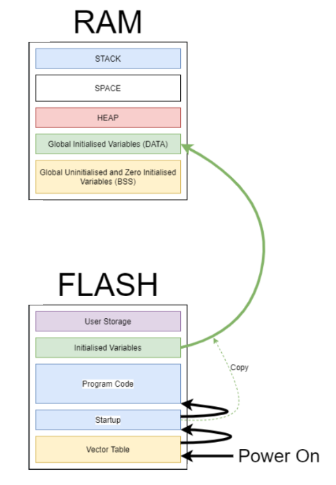

# Understanding Memory Layout
## 🌐 Reference: 
- https://www.linkedin.com/pulse/understanding-memory-layout-stack-heap-bss-data-text-segments-shah/
- https://computationstructures.org/lectures/stacks/stacks.html
- https://shatteredsilicon.co.uk/2021/01/22/microcontroller-memory-layout/

## 📚 Table of Contents
- [Microcontroller memory layout](#microcontroller-memory-layout)
  - [RAM memory](#ram-memory)
    - [Variables fall into several categories](#variables-fall-into-several-categories)
    - [Global Variables Uninitialised and Zero Initialised](#global-variables-uninitialised-and-zero-initialised)
    - [Global variables Initialised](#global-variables-initialised)
    - [Local Variables (STACK)](#local-variables-stack)
    - [HEAP](#heap)
  - [FLASH memory](#flash-memory)

  
## Microcontroller memory layout
😎 First we have different types of memory `Flash (Non-volatile)` and `Ram (Volatile)`.😎

**Let's start with a 😲 picture of our memory.**

    

### 🎯 RAM memory
#### Variables fall into several categories
- Global Variables Uninitialised and Zero Initialised.
- Global variables Initialised.
- Local Variables (We’ll look at these in the `Stacks section`)

#### Global Variables Uninitialised and Zero Initialised
*These are variables that are defined either with no assigned value or a value assigned to zero.*
- `Global` variables.
- `Static Global` variables. (*This is a global variable, but it can only be accessed within the file where it is defined; it is not accessible from other files in the program*)
- `Static Function` variables. (*A variable defined inside a function that retains its value between function calls and is only accessible within that function*)
~~~c
#include <stdio.h>

// Global Variable
int globalVar;

// Static Global Variable
static int StaticGlobalVar;

void Funtion(){
  // Static Function Variable
  static int staticVar = 0;
  staticVar++;
  printf("staticVar = %d\n", staticVar);
}

int main(){
  myFunction();
  myFunciont();
  return 0;
}
~~~

#### Global variables Initialised.
These are any global variable (as above) which are assigned a non 0 value on declaration.
~~~c
int globalVar = 10;

static int StaticGlobalVar = 20;

void myFunc(){
  static int staticVar = 30;
}
~~~

#### Local Variables (STACK) 
The 🔍[Stack](https://www.notion.so/How-does-the-Subroutine-work-f9d1448b9d9646bfb724801b865feb8b) segment is responsible for **managing function calls, local variables, and related data**. It operates using a Last-In-First-Out (LIFO) mechanism, where the most recently called function occupies the top of the stack. The stack is used to store function parameters, return addresses, and local variables. It automatically grows and shrinks as functions are called and return.

**Below is a sample code demonstrating the use of the `STACK` in an `ARM` microcontroller program:**
🔍[Introduciton to the ARM architecture](https://kmittal82.wordpress.com/2012/06/13/intro-to-the-arm-architecture/)
~~~c
#include <stdio.h>

int add(int a, int b) {
    int sum = a + b; 
    return sum;      
}

int main() {
    int x = 10;
    int y = 20;

    int result = add(x, y);

    printf("Result: %d\n", result);

    return 0;
}
~~~
👉 *Corresponding assembly code (Optimization: -O0)*
~~~assembly
add:
        push    {r7}
        sub     sp, sp, #20
        add     r7, sp, #0
        str     r0, [r7, #4]
        str     r1, [r7]
        ldr     r2, [r7, #4]
        ldr     r3, [r7]
        add     r3, r3, r2
        str     r3, [r7, #12]
        ldr     r3, [r7, #12]
        mov     r0, r3
        adds    r7, r7, #20
        mov     sp, r7
        ldr     r7, [sp], #4
        bx      lr
.LC0:
        .ascii  "Result: %d\012\000"
main:
        push    {r7, lr}
        sub     sp, sp, #16
        add     r7, sp, #0
        movs    r3, #10
        str     r3, [r7, #12]
        movs    r3, #20
        str     r3, [r7, #8]
        ldr     r1, [r7, #8]
        ldr     r0, [r7, #12]
        bl      add
        str     r0, [r7, #4]
        ldr     r1, [r7, #4]
        movw    r0, #:lower16:.LC0
        movt    r0, #:upper16:.LC0
        bl      printf
        movs    r3, #0
        mov     r0, r3
        adds    r7, r7, #16
        mov     sp, r7
        pop     {r7, pc}
~~~

#### HEAP
The heap segment is the area of memory used for dynamic memory allocation. It allows programs to request memory dynamically during `runtime` using functions like `malloc()`, `calloc()`, `realloc()` and `free()`. Unlike the stack, the heap memory must be explicitly managed by the programmer. It provides flexibility in allocating and deallocating memory as needed.

### 🎯 FLASH memory
